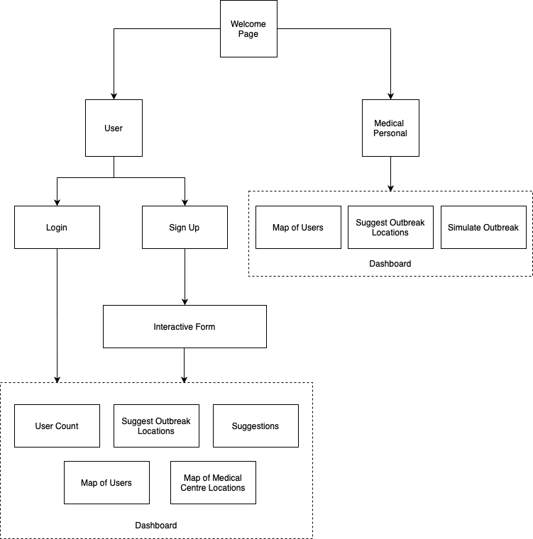

# Team JackNPitch 
### Pritthijit Nath & Shuvayan Ghosh Dastidar
#### Jadavpur University, Kolkata, India

## Architecture


## Unique Selling Points
### Target : Users and Medical Personnel
Unlike other apps which solely rely on presenting advice to the users, our idea intends to cater both the users and medical personnel alike, thus creating a strong and more effecient way to stop further spread of COVID-19.
### Privacy
All user data related fields such as `name,  email, phone, occupation, gender` are MD5 hashed, so that in case of an adversarial attack, user data can be kept safe. 
### Hotspot - Detection  
Based on the user location, hotspots will be identified which will help medical personnel to focus more on these specific spots and take appropriate action beforehand. (ToDo)
### SIR Model - Simulation
Medical Personnel will be able to create and analyse simulations on changing various state parameters, thereby helping them to analyse outbreak spread in both a quantitative and qualitative way. (ToDo)
### Heightened Caution
By displaying markers in the map with labels, users will be able to visualise hotspots beforehand thus allowing them to exercise proper caution when visiting such areas.
### Personalized Feedback
Based on the self-assessment, the risk factor is calculated thus helping the model to classify them into HighRisk or LowRisk patients, which further can help medical personnel to identify potential COVID-19 affected patients in an improved way.

## Backend
### Technology Stack Used :
1. ExpressJS
2. MongoDB

### Site :   [https://jacknpitch.herokuapp.com](https://jacknpitch.herokuapp.com) 

### Documentation
1. `GET /count` - Retrieves the count of users based on params 
	* `params : medic=true` - Retrieves the count of medical personnel in the database 
	* `params : users=true` - Retrieves the count of users registered in the database
2. `GET /locations` - Retrieves locations  and other details of the users
3. `POST /medicalCentre` - Adds a medical centre to the database
4.  `GET /medicalCentre` - Retrieves all the medical centres present in the database
5. `POST /users` - Adds a user to the database

Note: User specific routes have not been mentioned, they have been implemented as per `REST` Guidelines.


### Run in Local Machine
``` 
$ cd Backend
$ npm install
$ export MONGODB_URL=MONGODB_DATABASE_URI
$ export JWT_SECRET="PROGRAMMERS_DATE"
$ npm start 
```

## Frontend
### Technology Stack Used :
1. ReactJS

### Run in Local Machine
``` 
$ cd Frontend
$ yarn install
$ yarn start
```
